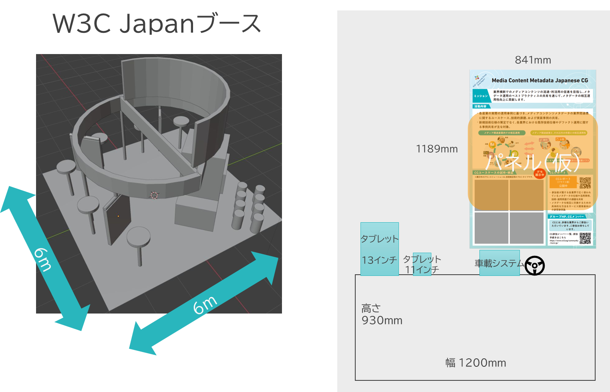
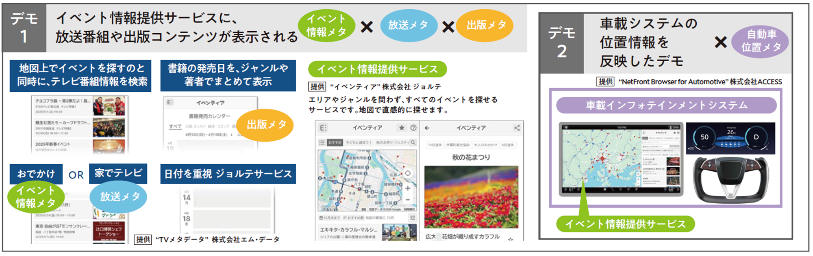
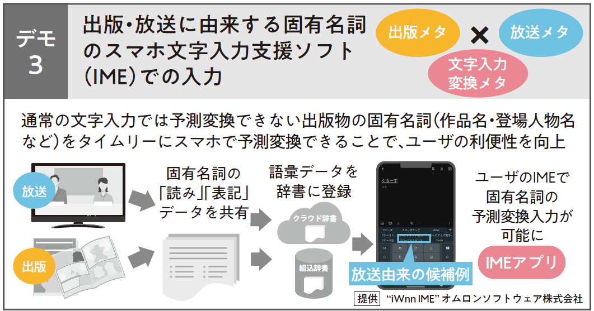
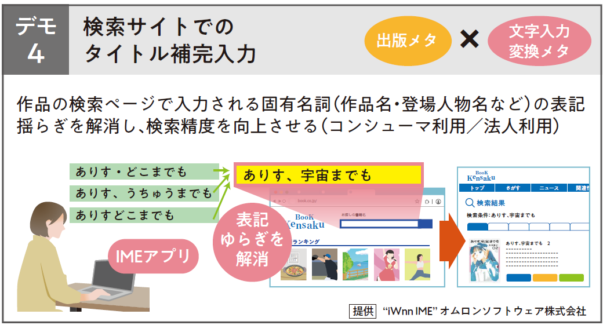
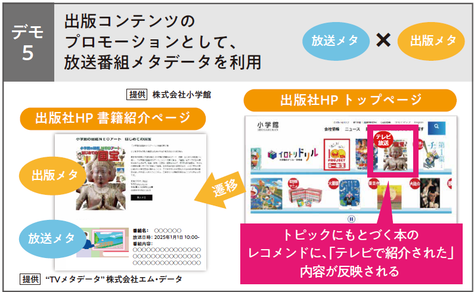
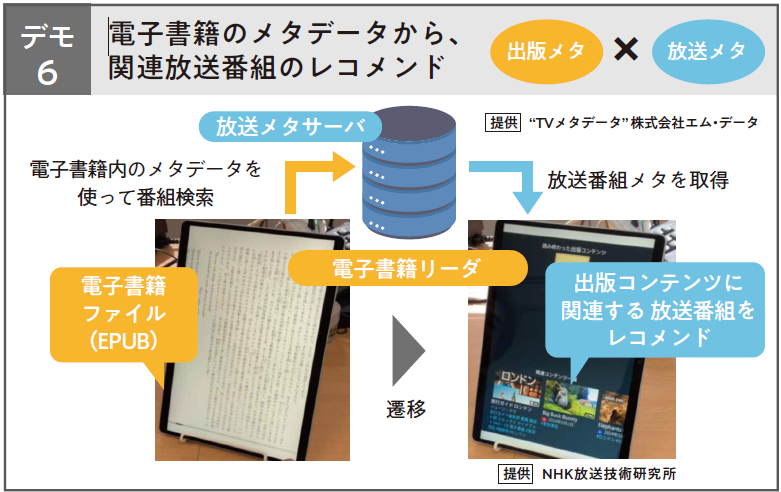

# Interop MCM-JP CG活動紹介展示

## 概要
- W3C Interop 2025において、Interop W3Cブースでの展示を行う予定です。
- MCM-JP CGミニブースを展示。CGの活動を広く知ってもらうことを目的としています。

## 展示ブースイメージ
- 

## メインパネル（2025/05/15版 要旨）
- [パネル案（2025/05/15版PDF）](20250515_panel.pdf)
- 内容
  - MCM-JP CGとは？
  - 主な活動内容
  - ユースケース紹介
  - CGレポート
  - 参加方法・連絡先

## デモ

### デモ1: イベント情報提供サービスに、放送番組や出版コンテンツが表示される
### デモ2: 車載システムの位置情報を反映（デモ1「イベント情報提供サービス事例」の応用)

### デモ3: 出版・放送に由来する固有名詞のスマホ文字入力支援ソフト（IME）での入力

### デモ4: 検索サイトでの正確なタイトル補完入力

### デモ5: 出版コンテンツのプロモーションとして、放送番組メタデータを利用

### デモ6: 電子書籍のメタデータから、関連放送番組のレコメンド

## リンク
- Interop公式: https://www.interop.jp/
- W3Cブース: https://f2ff.jp/2025/interop/exhibitor/show.php?id=3006