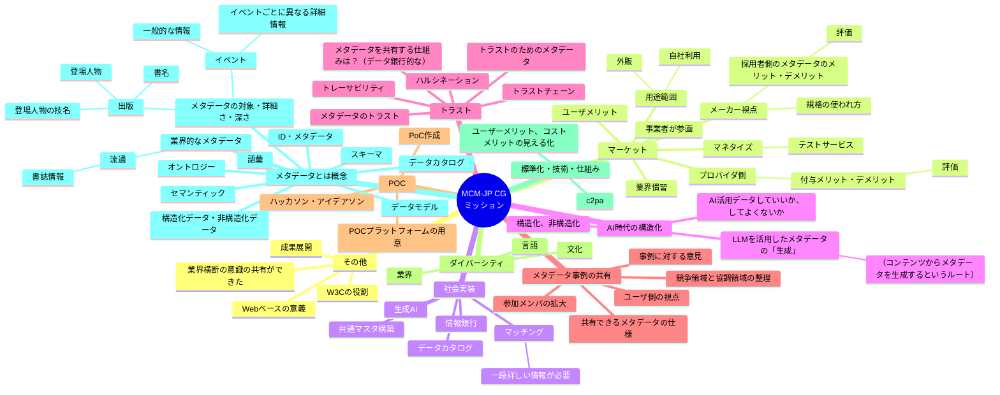

# MCM-JP CG 概念マップ (2025-07-31)

## 作業の目的
- CG設立からおよそ1年： CGとしてアクティブな活動、成果を挙げられた
- 活動全体をレビュー、次の準備・実行について、CGメンバー間での認識を共有する

## 目標
- CG活動成果の見える化を通じて、次の「準備」・「実行」の位置づけ案を作成する
  - 見落としを防ぐ
  - 共通項をみつける
  - 全体の関連性を整理する
- テーマ：MCM-JP CGミッション「メディアコンテンツ業界間流通促進に向けたメタデータ相互運用性の向上」

## 進め方
1. 目標の共有・テーマ設定[10]
2. 活動成果の振り返り、期待に関するアイディア（発散）[10]
   - 関連する概念などをリストアップ：見落としの防止
3. いったんマッピング（収束）[10]
   - ノード・リンクで整理
4. 各ノードにそれぞれノードを追加していく（発散）[10]
   - 今後への展開の期待、新規目標設定のアイディア
5. あらためて、ノードの置き場所・リンク調整（収束）[10]

### 進め方参考用サンプル
- [参考用サンプル資料](./map_samples.md)

---

## 概念マップ（2025/7/31版）

