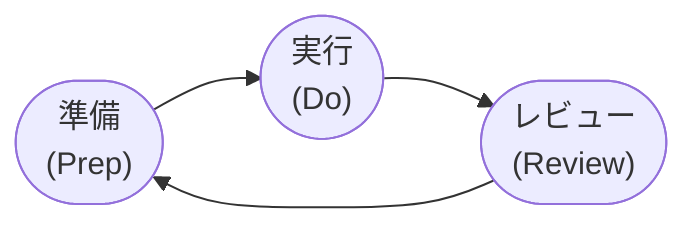
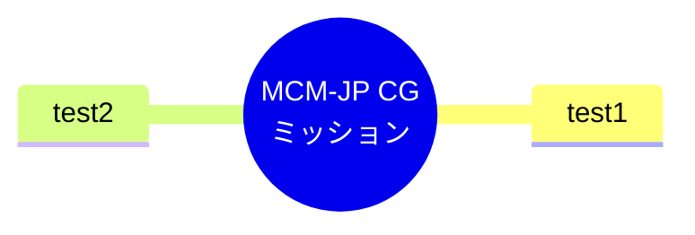
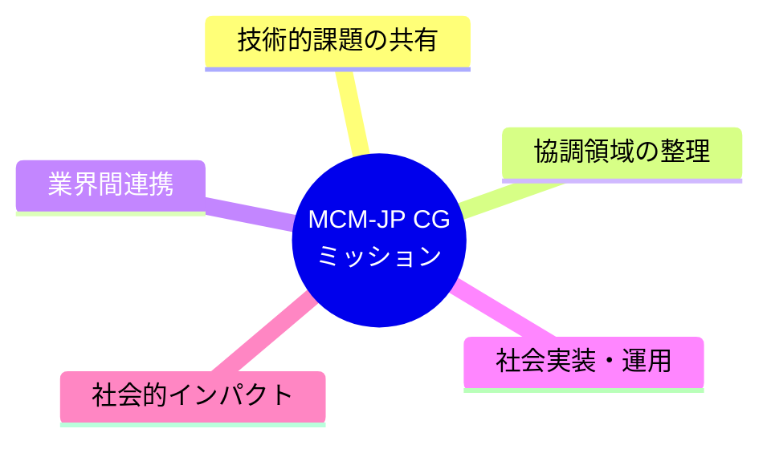
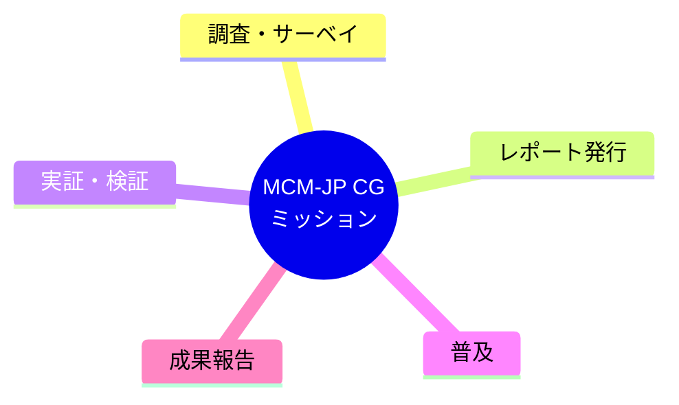
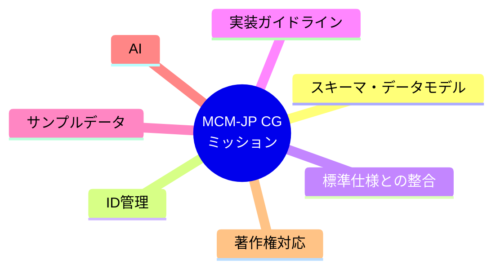
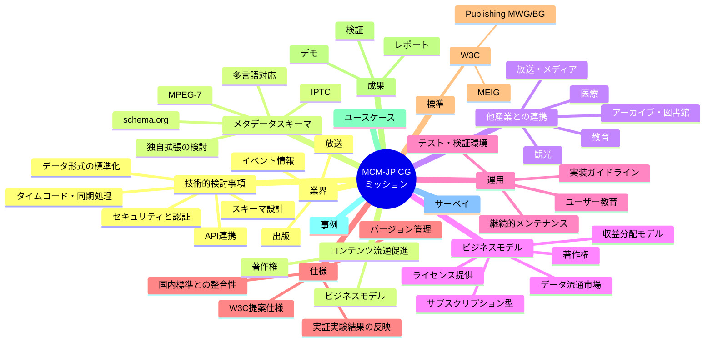

# MCM-JP CG 概念マップ (2025-07-31)

## 作業の目的
- CG設立からおよそ1年： CGとしてアクティブな活動、成果を挙げられた
- 活動全体をレビュー、次の準備・実行について、CGメンバー間での認識を共有する

## 目標
- CG活動成果の見える化を通じて、次の「準備」・「実行」の位置づけ案を作成する
  - 見落としを防ぐ
  - 共通項をみつける
  - 全体の関連性を整理する
- テーマ：MCM-JP CGミッション「メディアコンテンツ業界間流通促進に向けたメタデータ相互運用性の向上」

## 進め方
1. 目標の共有・テーマ設定[10]
2. 活動成果の振り返り、期待に関するアイディア（発散）[10]
   - 関連する概念などをリストアップ：見落としの防止
3. いったんマッピング（収束）[10]
   - ノード・リンクで整理
4. 各ノードにそれぞれノードを追加していく（発散）[10]
   - 今後への展開の期待、新規目標設定のアイディア
5. あらためて、ノードの置き場所・リンク調整（収束）[10]

---

## マップ

---

### サンプル

#### 目標ベース

#### 作業ベース

#### 技術・仕様ベース

### （参考）マップ：CGチャータ・レポートから生成

### （参考）関連概念・キーワード

- メディアメタデータ
- 相互運用性
- スキーマ設計
- API連携
- データ形式の標準化
- 認証技術
- セキュリティ対策
- メタデータスキーマ
- MPEG-7
- Schema.org
- IPTC標準
- RDFモデル
- JSON-LD構造
- XML構造
- 多言語対応
- メタデータの拡張性
- コンテンツ流通促進
- 著作権管理
- ライセンス提供
- サブスクリプションモデル
- データ流通市場
- 収益分配モデル
- 実装ガイドライン
- テスト環境構築
- ユーザー教育
- 継続的メンテナンス
- W3C提案仕様
- 国内標準との整合性
- 実証実験の反映
- ユースケース分析
- サーベイ調査
- デモンストレーション
- レポート作成
- 放送業界との連携
- 出版業界との連携
- 医療分野との連携
- 教育分野との連携
- 観光分野との連携
- アーカイブ機関との連携
- 図書館との連携
- イベント情報の活用
- MEIG（W3C）との協働
- Publishing MWG/BGとの協働
- データポータビリティ
- オープンデータ活用
- FAIR原則の適用
- デジタルアイデンティティ管理
- メタデータ
- 相互運用
- スキーマ
- API
- JSON
- XML
- RDF
- OWL
- リンクトデータ
- タイムコード
- 同期
- 認証
- 認可
- MPEG
- IPTC
- ダブリンコア
- クリエイティブ・コモンズ
- ライセンス
- サブスクリプション
- データマーケット
- マネタイズ
- 実装
- テスト
- 検証
- ドキュメント
- 教育
- メンテナンス
- 標準化
- W3C
- ISO
- JIS
- ユースケース
- サーベイ
- デモ
- レポート
- 放送
- 出版
- 医療
- 観光
- アーカイブ
- 図書館
- イベント
- MEIG
- MWG
- FAIR原則
- オープンデータ
- ID管理
- コンテンツID（CID / cIDf）
- DCD（Distributed Content Description）
- 著作権レイヤ
- システムレイヤ
- 権利処理モデル
- 電子透かし
- IPR-DB（知的財産権データベース）
- RA（登録認定機関）
- コンテンツID発行センタ
- 課金決済システム
- 電子認証機関
- メタデータ標準化
- Dublin Core
- MPEG-7 / MPEG-21
- TV Anytime / CRID
- GS1 / EPCIS / CBV
- DOIとの整合性
- メタデータの埋め込み・分離モデル
- ユニークコード管理
- コンテンツ処理フロー（制作〜販売）
- メディアコンテンツの相互運用性  
- 業界横断コミュニティ  
- メタデータ仕様の違いと調整  
- ユースケース共有と技術検証  
- イベント情報メタデータ  
- 出版メタデータ  
- 放送メタデータ  
- 自動車位置メタデータ  
- 文字入力変換メタデータ（IME）  
- 検索補完・表記揺れ対策  
- 電子書籍メタデータ（EPUB）  
- レコメンド機能とメタデータ連携  
- 番組紹介と出版プロモーションの連携  

---
