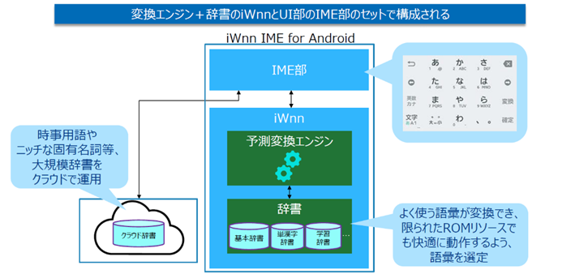
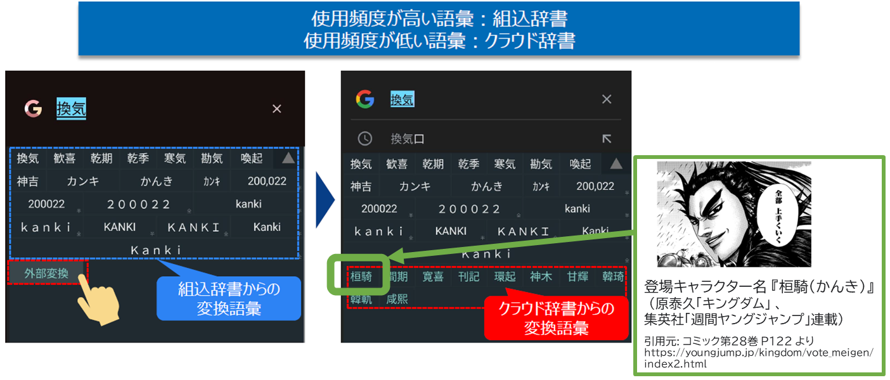
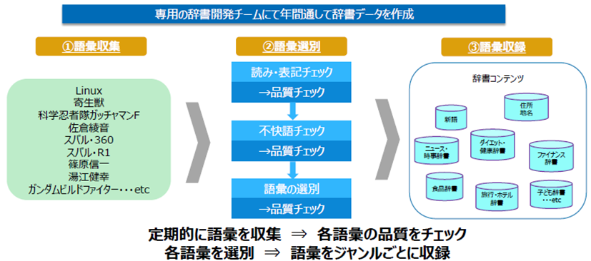
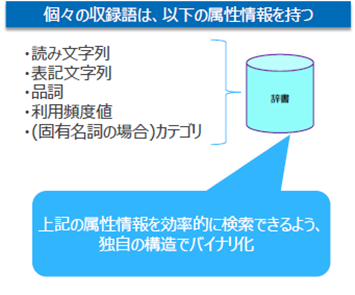

# 固有名詞に関するメタデータの流通とIME辞書データへの活用

## 作成者
- 出野（オムロンソフトウェア）

## 関連する産業ドメイン
- 出版
- コミュニケーションツール（IME）

## 事例概要
- メディアコンテンツに関する固有名詞データが流通し、そのデータに基づきIMEで文字変換ができる
  - [参考資料](https://github.com/w3c-cg/mcm-jp/blob/main/meetings/2024-07-25/20240725_mcm-jp-cg_%E3%82%AA%E3%83%A0%E3%83%AD%E3%83%B3%E3%82%BD%E3%83%95%E3%83%88%E3%82%A6%E3%82%A7%E3%82%A2IME%E7%B4%B9%E4%BB%8B%E8%B3%87%E6%96%99.pdf)

## 目的
流通するデータをもとに、メディアコンテンツに関する新しい固有名詞について、ユーザが文字変換できるようにすること

## シナリオ

1. 出版社が、マンガを発売する
1. 出版社が、マンガの登場キャラクタ等の固有名詞をメタデータ化する（以下、マンガメタデータ）
1. IME事業者が、マンガメタデータを入手する
1. IME事業者が、市場での需要を鑑み、マンガメタデータを選別し、IME辞書コンテンツとして収録する
1. IME事業者が、収録した辞書コンテンツをスマートフォンにインストールされているIMEに反映する
1. スマートフォンユーザは、マンガの登場キャラクタ名を文字入力する際、IMEで変換できる

### 実装例（任意）

#### スマートフォン向け IME(iWnn IME for Android)＋クラウド辞書

- 【iWnn IME for Android】

- 【組込辞書とクラウド辞書の変換例】

- 【辞書開発プロセス】

- 【辞書データ構造】

### 参照仕様など（任意）

## CGへの課題共有

