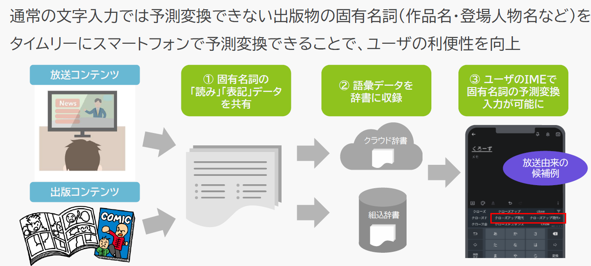

# 固有名詞に関するIME辞書データの自社作成と展開 / In-house Development and Deployment of IME Dictionary Data for Proper Nouns

## 作成者
- 出野 健太郎（オムロンデジタル）

## 関連する産業ドメイン
- 出版
- 放送
- コミュニケーションツール（IME）

## 事例概要
- メディアコンテンツに関連する固有名詞をIMEで文字変換できる

## 目的
メディアコンテンツに関する新しい固有名詞について、ユーザが文字変換できるようにすること

## シナリオ

1. 出版社が書籍を発売する／放送事業者が放送コンテンツを制作・放送する
1. 出版社が書籍の書誌情報／放送事業者が放送コンテンツの番組名等情報を共有する
1. IME事業者が共有された書誌情報・番組名等情報の「読み」「表記」データ（以下、語彙データ）を市場での需要を鑑み、選別した上で語彙データとしてIME辞書コンテンツとして収録する
1. IME事業者が、収録した辞書コンテンツをスマートフォンにインストールされているIMEに反映する
1. スマートフォンユーザは、書籍のタイトル名や放送番組名を文字入力する際、IMEで変換できる

### 実装例（任意）

#### スマートフォン向け IME(iWnn IME for Android)＋クラウド辞書

- 【iWnn IME for Android】

- 【辞書開発プロセス】

- 【辞書データ構造】

### 参照仕様など（任意）

## CGへの課題共有

