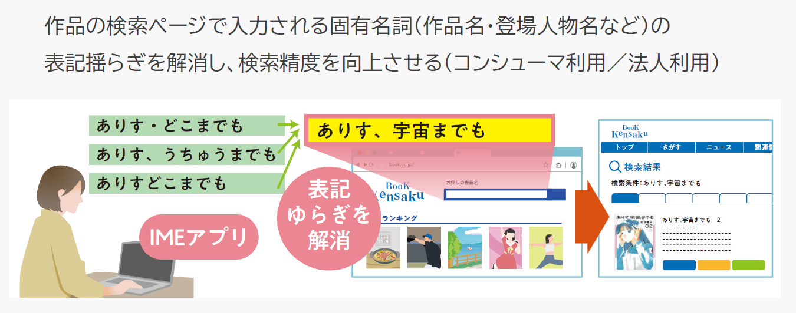

# 書籍検索サイトでのタイトル補完入力 / Book title autocomplete input on a book search site

## 作成者
- 出野 健太郎（オムロンデジタル）

## 関連する産業ドメイン
- 出版
- コミュニケーションツール（IME）

## 事例概要
- 書籍検索サイトでのWeb埋め込み側IMEによるタイトル補完入力

## 目的
作品の検索ページで入力される固有名詞（作品名・登場人物名など）の表記揺らぎを解消し、検索精度を向上させる

## シナリオ

1. 出版社が、書籍を発売する
1. 出版社が、書誌情報をデータベース化する
1. IME事業者が、Web埋め込み側IME（以下、Web IME）と読み揺らぎパターン自動生成機能付き辞書作成ツールを出版社に提供する
1. 出版社が、Web IMEを書籍検索サイトの検索BOXにWeb IMEを組み込む
1. 出版社が、書誌情報データベースから書籍タイトルの正しい「読み」および読み揺らぎパターンの「読み」／「表記」情報をWeb IMEの辞書データとして登録する
1. 書籍検索サイト利用ユーザは、書籍検索の際、間違えた読みを入力しても正しい書籍タイトルの文字変換ができることで、意図した書籍検索結果が得られる

### 実装例（任意）

### 参照仕様など（任意）

## CGへの課題共有

